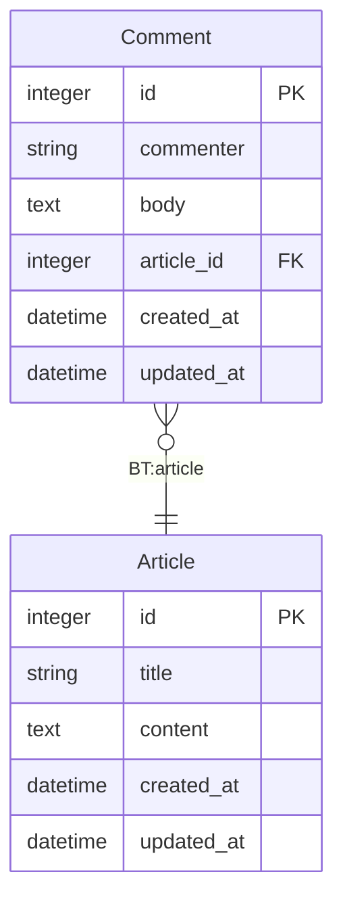

# rails-mermaid_erd_markdown

This is a rails gem that extends the rails-mermaid_erd gem to generate a mermaid ERD for Rails Models in markdown directly in source code. This avoids the need to download the ERD through a html page, which can be difficult for scenarios where one would like to programmatically generate an ERD.

## Installation

Add this line to your application's Gemfile:

```ruby
gem 'rails-mermaid_erd_markdown'
```

And then execute:

    $ bundle install

Or install it yourself as:

    $ gem install rails-mermaid_erd_markdown

## Usage

To generate a mermaid ERD in markdown, run `rails generate_erd` or `rake generate_erd` from the terminal

The default path for the generated ERD is `app/models/ERD.md`. You can modify this by creating an `erd.yml` file in the root directory
and modifying the `result_path` as seen in the example at `docs/examples/erd.yml`. Make sure to include the markdown file name you 
wish to generate in the path. 

If an ERD already exists at the path specified, it will be parsed to determine if it is up to date. If it is, nothing happens. If it 
is not up to date, the ERD will be updated. 

One can create self-updating, living documentation by integrating this rake task into their CI. This ensures that the ERD is always up 
to date and accurately describes the latest state of the models and their relationships.

You can view the ERD by navigating to the file in Github, which supports rendering mermaid diagrams from code. If you are a Visual 
Studio Code user, you can use the [Markdown Preview Enhanced](https://marketplace.visualstudio.com/items?itemName=shd101wyy.markdown-preview-enhanced) extension to view the ERD directly in your IDE. 

## Example ERD



## Development

After checking out the repo, run `bin/setup` to install dependencies. Then, run `rake test` to run the tests. You can also run `bin/console` for an interactive prompt that will allow you to experiment.

To install this gem onto your local machine, run `bundle exec rake install`. To release a new version, update the version number in `version.rb`, and then run `bundle exec rake release`, which will create a git tag for the version, push git commits and the created tag, and push the `.gem` file to [rubygems.org](https://rubygems.org).

## Contributing

Bug reports and pull requests are welcome on GitHub at https://github.com/[USERNAME]/rails-mermaid_erd_markdown. This project is intended to be a safe, welcoming space for collaboration, and contributors are expected to adhere to the [code of conduct](https://github.com/[USERNAME]/rails-mermaid_erd_markdown/blob/master/CODE_OF_CONDUCT.md).

## License

The gem is available as open source under the terms of the [MIT License](https://opensource.org/licenses/MIT).

## Code of Conduct

Everyone interacting in the rails-mermaid_erd_markdown project's codebases, issue trackers, chat rooms and mailing lists is expected to follow the [code of conduct](https://github.com/[USERNAME]/rails-mermaid_erd_markdown/blob/master/CODE_OF_CONDUCT.md).
