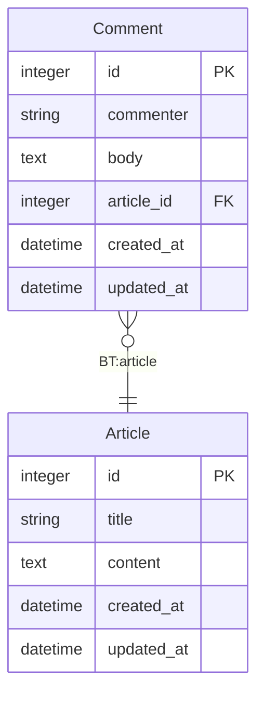

```mermaid
erDiagram
    %% --------------------------------------------------------
    %% Entity-Relationship Diagram
    %% --------------------------------------------------------

    %% table name: articles
    Article{
        integer id PK 
        string title  
        text content  
        datetime created_at  
        datetime updated_at  
    }

    %% table name: comments
    Comment{
        integer id PK 
        string commenter  
        text body  
        integer article_id FK 
        datetime created_at  
        datetime updated_at  
    }

    Comment }o--|| Article : "BT:article"
```