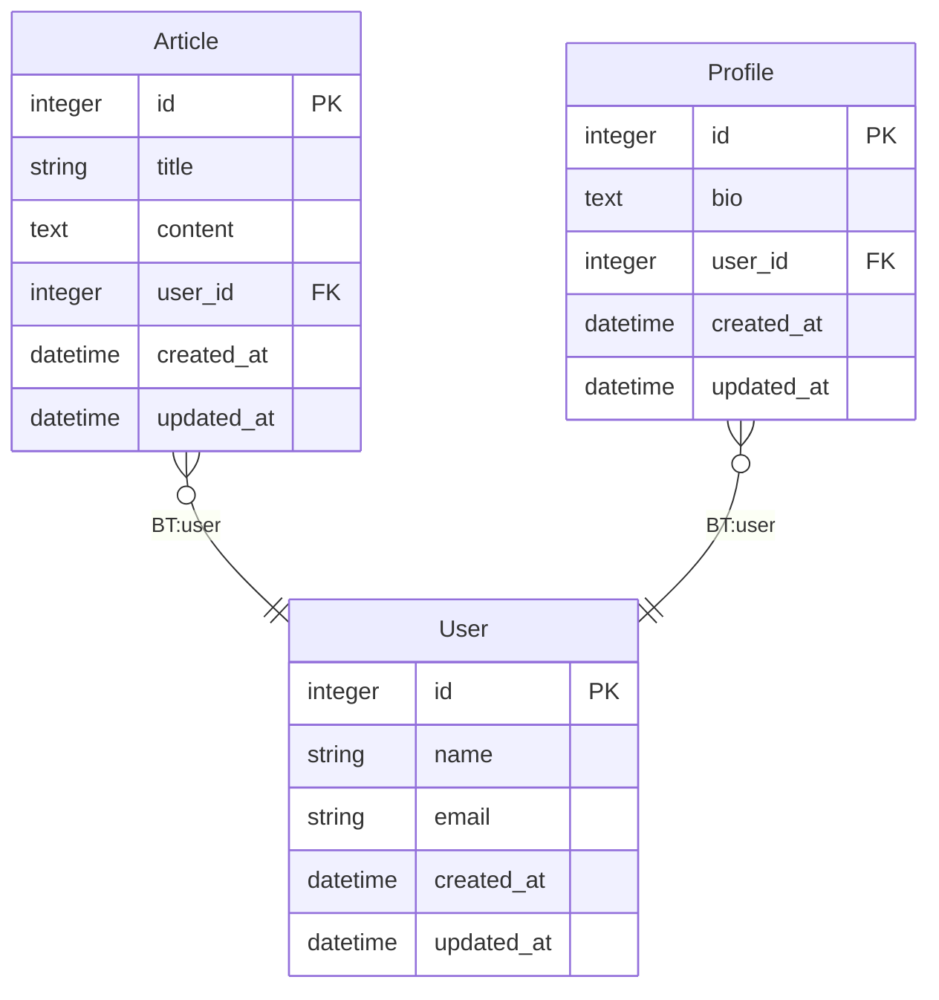

# User Entity-Relationship Diagram

## Associated Models

- [Article](app/models/ERD_Article.md)
- [Profile](app/models/ERD_Profile.md)

## Entity-Relationship Diagram

```mermaid
erDiagram
    %% --------------------------------------------------------
    %% Entity-Relationship Diagram
    %% --------------------------------------------------------

    %% table name: users
    User{
        integer id PK
        string name
        string email
        datetime created_at
        datetime updated_at
    }

    %% table name: articles
    Article{
        integer id PK
        string title
        text content
        integer user_id FK
        datetime created_at
        datetime updated_at
    }

    %% table name: profiles
    Profile{
        integer id PK
        text bio
        integer user_id FK
        datetime created_at
        datetime updated_at
    }

    Article }o--|| User : "BT:user"
    Profile }o--|| User : "BT:user"
```